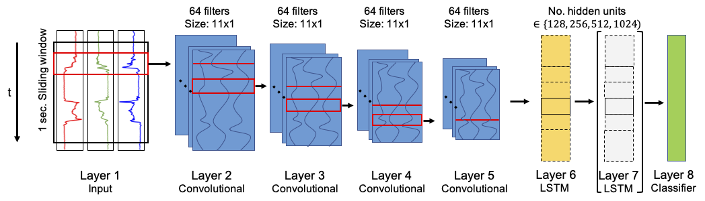
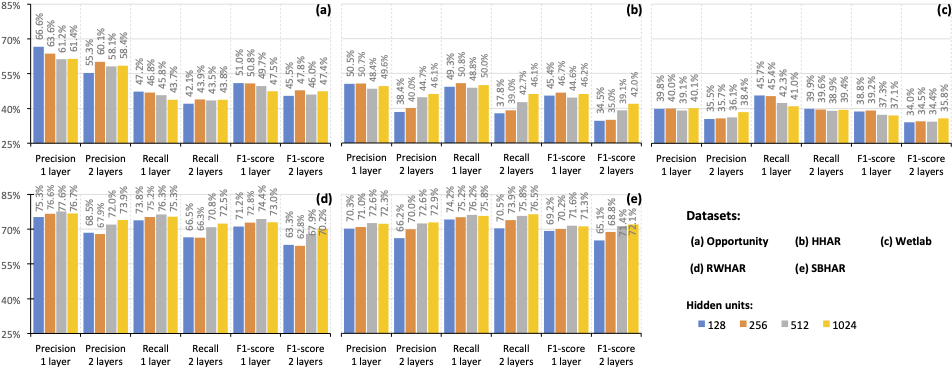
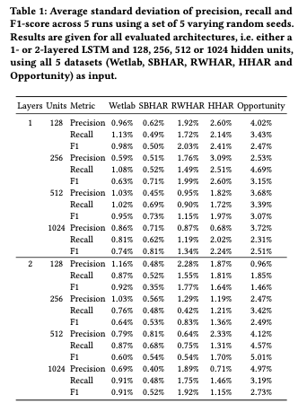
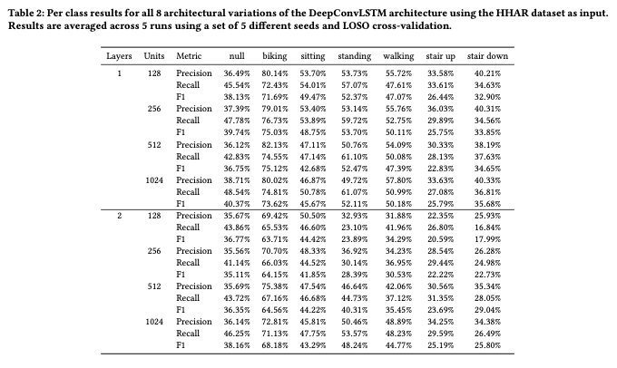
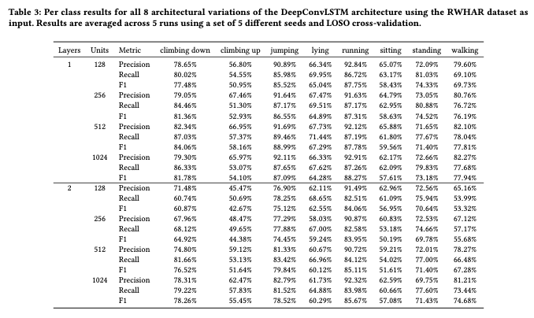
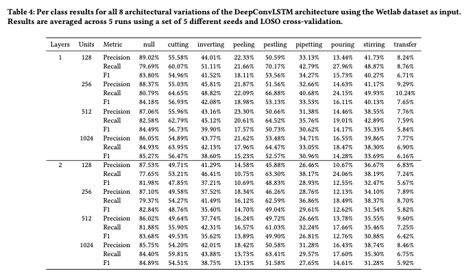
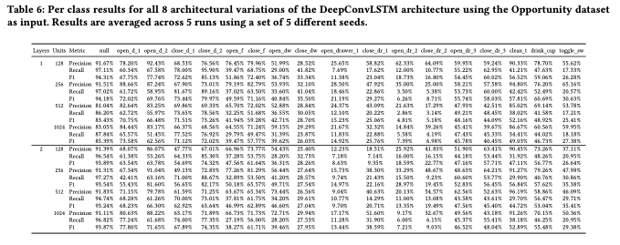

# Improving Deep Learning for HAR with shallow LSTMs (ISWC 21' Note paper)

This is the official GitHub page of the note paper publication "Improving Deep Learning for HAR with shallow LSTMs" presented at the International Symposium on Wearable Computers 21' (ISWC 21'). [[cite our work]](#cite)

## Abstract
Recent studies in Human Activity Recognition (HAR) have shown that Deep Learning methods are able to outperform classical Machine Learning algorithms. One popular Deep Learning architecture in HAR is the DeepConvLSTM. In this paper we propose to alter the DeepConvLSTM architecture to employ a 1-layered instead of a 2-layered LSTM. We validate our architecture change on 5 publicly available HAR datasets by comparing the predictive performance with and without the change employing varying hidden units within the LSTM layer(s). Results show that across all datasets, our architecture consistently improves on the original one: Recognition performance increases up to 11.7% for the F1-score,and our architecture significantly decreases the amount of learnable parameters. This improvement over DeepConvLSTM decreases training time by as much as 48%. Our results stand in contrast to the belief that one needs at least a 2-layered LSTM when dealing with sequential data. Based on our results we argue that said claim might not be applicable to sensor-based HAR.

<p align="center">
  
</p>

## Results
Results were obtained on the Wetlab [[4]](#4), RWHAR [[6]](#6), SBHAR [[2]](#2) and HHAR [[5]](#5) dataset using LOSO cross-validation and Opportunity dataset [[3]](#3) using the train-test split as employed in [[1]](#1) averaged across 5 runs using a set of 5 different random seeds.

### Overall results
<p align="center">
  
</p>

### Standard deviation across runs
<p align="center">
  
</p>

### Per-class results

<p align="center">
  
</p>

<p align="center">
  
</p>

<p align="center">
  
</p>

<p align="center">
  
</p>

<p align="center">
  
</p>

## Repo Structure
- log_files: folder containing all log files of experiments mentioned in the paper
- job_scripts: contains files with terminal commands corresponding to the experiments mentioned in the paper
- data_processing: contains file for data processing (analysis, creation, preprocessing and sliding window approach)
- model: folder containing the DeepConvLSTM model, train and evaluation script
- main.py: main script which is to be run in order to commence experiments
- Results.xlsx: excel file containing all expererimental results presented in the paper

## Datasets

The datasets (raw and preprocessed data) used during experiments can be either downloaded via this link: https://uni-siegen.sciebo.de/s/sMWQ2vJhDzM6sil

PW: iswc21

The datasets need to be put in a seperate '/data' directory within the main directory of the repository in order for the main.py script to work.

### Dataset creation

Coming soon

## (Re-)running experiments

To run experiments one can either modify the main.py file (see hyperparameter settings in the beginning of the file or run the script via terminal and giving necessary hyperparameters via flags. See the main.py file for all possible hyperparameters which can be used. All terminal commands used during our experiments can be found in the corresponding job script file in the job_scripts folder. 

## Available log files of experiments

Note that within the log files accuracy, precision, recall and F1-score inbetween epochs were calculated using a 'weighted' and not 'macro' approach (see https://scikit-learn.org/stable/modules/generated/sklearn.metrics.f1_score.html for the difference between the two). Note that thus temporary results will be different if re-run, but final results will still be the same as reported in our publication.

## Results file

The results excel sheet (results.xlsx) contains all results mentioned within the paper and GitHub as well as aggregated information about the standard deviation across runs, per-class results and standard deviation across subjects.

## Installing PyAV
- For Linux: 
```
git clone https://github.com/pscholl/PyAV
sudo apt-get install libx264-dev
sudo apt-get install libavformat-dev
sudo apt-get install libavdevice-dev
conda install cython
cd PyAV
./scripts/build-deps
make
```
## Citation
<a id="cite">Cite this work as: </a><br/> 
Marius Bock, Alexander Hölzemann, Michael Moeller, and Kristof Van Laerhoven. 2021. Improving Deep Learning for HAR with shallow LSTMs. In 2021 International Symposium on Wearable Computers (ISWC ’21), September 21–26, 2021, Virtual, USA. ACM, New York, NY, USA, 6 pages. https://doi.org/10.1145/3460421.3480419

## Dataset References
<a id="1">[1]</a> 
Francisco Javier Ordóñez and Daniel Roggen. 2016. 
Deep Convolutional and LSTM Recurrent Neural Networks for Multimodal Wearable Activity Recognition.
Sensors16, 1 (2016).  https://doi.org/10.3390/s16010115

<a id="2">[2]</a> 
Jorge-L. Reyes-Ortiz, Luca Oneto, Albert Samà, Xavier Parra, and Davide Anguita. 2016. Transition-Aware Human Activity Recognition Using Smartphoneson-Body Localization of Wearable Devices: An Investigation of Position-Aware ActivityRecognition. Neurocomputing 171 (2016), 754–767.    https://doi.org/10.1016/j.neucom.2015.07.085

<a id="3">[3]</a> 
Daniel Roggen, Alberto Calatroni, Mirco Rossi, Thomas Holleczek, Kilian Förster,Gerhard Tröster, Paul Lukowicz, David Bannach, Gerald Pirkl, Alois Ferscha, Jakob Doppler, Clemens Holzmann, Marc Kurz, Gerald Holl, Ricardo Chavarriaga, Hesam Sagha, Hamidreza Bayati, Marco Creatura, and José del R. Millàn. 2010. Collecting Complex Activity Datasets in Highly Rich Networked Sensor Environments. In 7th International Conference on Networked Sensing Systems. 233-240. https://doi.org/10.1109/INSS.2010.5573462

<a id="4">[4]</a> 
Philipp M. Scholl, Matthias Wille, and Kristof Van Laerhoven. 2015. Wearables in the Wet Lab: A Laboratory System for Capturing and Guiding Experiments. 589–599.  https://doi.org/10.1145/2750858.2807547

<a id="5">[5]</a> 
Allan Stisen, Henrik Blunck, Sourav Bhattacharya, Thor S. Prentow, Mikkel B.Kjærgaard, Anind Dey, Tobias Sonne, and Mads M. Jensen. 2015. Smart Devices are Different: Assessing and Mitigating Mobile Sensing Heterogeneities for Activity Recognition. In Proceedings of the 13th ACM Conference on Embedded Networked Sensor Systems. 127–140. https://doi.org/10.1145/2809695.2809718

<a id="6">[6]</a> 
Timo Sztyler and Heiner Stuckenschmidt. 2016. On-Body Localization of Wearable Devices: An Investigation of Position-Aware Activity Recognition. In IEEE International Conference on Pervasive Computing and Communications. 1–9. https://doi.org/10.1109/PERCOM.2016.7456521
  
